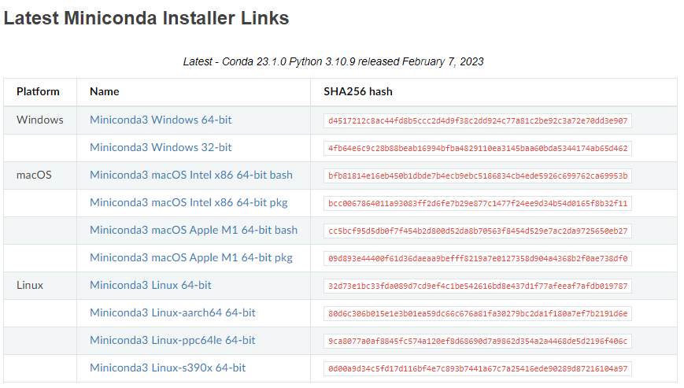
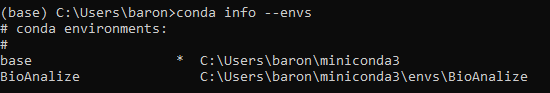
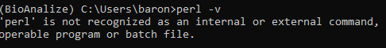
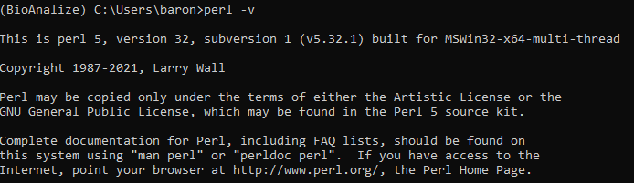
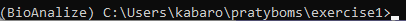

# VISADA PASITIKRINKITE "Kitam kartui.md"

# Pratybos
"Biotechnologijos metodai ir bioinformacinė analizė" užsiėmimų pratybų medžiaga medicinos genetikos pirmo kurso studentams.

# Atsiskaitymas už pratybas
Studentas savarankiškai paruošia duotos klinikinės situacijos analizės pristatymą. 

# Pristatymo vertinimo kriterijai
#### Klinikinės situacijos aptarimas – paciento fenotipas, atlikti instrumentiniai tyrimai, genealogija, kiti svarbūs faktai apie pacientą (2 balai);

#### NKS duomenų analizės rezultatai – pacientui nustatytų kliniškai reikšmingų genomo variantų analizė, in silico įverčių aptarimas, baltymo struktūros pokyčių įvertinimas ir vizualizacija (4 balai);

#### Genotipo ir paciento fenotipo analizė – gautų rezultatų susiejimas su paciento fenotipu, išvados formulavimas ir pateikimas (genotipas pagal HGVS nomenklatūrą) (2 balai);

#### Atsakymai į pateiktus klausimus (2 balai).

# Pasiruošimas praktiniam darbui

## Reikalinga programinė įranga
Programinė įranga priklauso nuo Jūsų gebėjimo valdyti terminalą bei komandines eilutes. Dažnai MacOS ar Linux vartojams papildomos programinės įrangos nereikia. Tačiau Windows vartotojai susiduria su papildomomis problemomis.

Pagrindiniai programiniai paketai naudojami failų anotavimui - `Perl` ir `ANNOVAR`.

Prisiminimui pagrindinės UNIX komandos - https://maker.pro/linux/tutorial/basic-linux-commands-for-beginners

## Windows

Programinės įrangos valdymui Windows aplinkoje rekomenduoju naudoti `Anaconda`.


Šių pratybų tikslams pasiekti naudosime paprastą "Light" tipo `Anaconda` versiją, kuri užima nedaug resursų ir tausoja vietą - [Miniconda3](https://docs.conda.io/en/latest/miniconda.html)



Po sėkmingos instaliacijos paspaudus "Start" ieškome "Anaconda prompt (miniconda3)".

## MacOS

MacOS aplinkoje turite terminalą ir priėjimą prie visų paprastų UNIX komandų. Dėl paprastumo rekomenduoju, taip pat, įsidiegti [Miniconda3](https://docs.conda.io/en/latest/miniconda.html).

## Linux

Linux vartotojams dažnai papildomų "organizacinių" paketų instaliuoti nereikia.

## Suinstaliavus Anaconda ar Miniconda

Suinstaliavus `Anaconda (conda)` rekomenduoju sekti [nuorodą](https://conda.io/projects/conda/en/latest/user-guide/getting-started.html) ir patikrinti ar teisingai įrašėte programinę įrangą.

Atsidariusiame lange įrašome:
```
conda --version
```
Ir turėtumete matyti išvestį:
```
conda 23.1.0
```
Atnaujinkime condą naudodami eilutę (su visais pakeitimais sutinkame -y):
```
conda update conda -y
```
Atliekame conda "Solver" pakeitimą į greitesnį:
```
conda install -n base conda-libmamba-solver -y
```
Nustatome naują "Solver" versiją:
```
conda config --set solver libmamba
```

## Darbinės aplinkos sukurimas

Tikriausiai pastebėjote, kad įvesties eilutės pradžioje matote `(base)` aplinkos indikatorių. Pratyboms susikurkime atskirą darbinę aplinką:
```
conda create --name BioAnalize
```
Norėdami patenkti į tik sukurtą darbinę aplinką naudojame komandą:
```
conda activate BioAnalize
```
Norėdami iš jos išeiti ir grįžti į pagrindinę (base) aplinką galite naudoti komandą:
```
conda deactivate
```
*** Norėdami pažiūrėti sukurtų darbinių aplinkų sąrašą naudokite komandą:
```
conda info --envs
```


Išbandykite komandas ir galime judėti toliau.

## Perl įrašymas
`Perl` programa būtina ANNOVAR programos veikimui, tad pirma patikrinkite, galbūt, `Perl` programinė įranga jau instaliuota:
```
perl -v
```
Jeigu matote tokią išvestį, vadinasi `Perl` programinė įranga neįdiegta.



```
Kokią komandą naudosite perl programinės įrangos įrašymui?
```

Perl įrašymą patikrinkite naudodami tą pačią eilutę:
```
perl -v
```
Jeigu viską padarėte teisingai turėtumėte pamatyti tokį vaizdą:



* Naudodami "conda activate base" komandą grįškite į pradinę darbinę aplinką ir suveskite "perl -v". Atlikę teisingai iki šiol pateiktas užduotis turėtumėte gauti klaidą. Kodėl taip nutiko? Viskas dėl to, kad programinę įrangą įrašėme į BioAnalize darbinę aplinką. Iš kitos aplinkos įrašytų programinių paketų nepasieksime. Taip veikia conda "organizatorius"

## Pratybomų medžiagos atsisiuntimas
Failų atsisiuntimui naudokime `wget` paketą, o išpakavimui `unzip` ar `tar` paketą. Norėdami parsisiųsti programinius paketus į savo darbinę aplinką naudokite komandas:
```
conda activate BioAnalize
```
```
conda install -c menpo wget -y
```
```
conda install -c conda-forge m2-unzip -y
```
Sukurkite atskirą direktoriją pratyboms ir į ją įeikite.
```
Kokias dvi komandas naudosite užduočiai atlikti? Kokios komandos pagalba patvirtinti kokioje direktorijoje esate?
```
Jeigu kyla klausimų galite užeiti į tinklapį - https://maker.pro/linux/tutorial/basic-linux-commands-for-beginners

// Aptarimo taškas. Prieš tęsdami darbus aptarkime eigą.

## ANNOVAR užduotis

ANNOVAR tai puikus įrankis skirtas atlikti anotaciją. Visą dokumentaciją galite rasti užėję į [oficialų tinklapį](https://annovar.openbioinformatics.org/en/latest/). Užduotims atlikti naudosime supaprastintą "lengvą" ANNOVAR versiją, kuri paprastai, su visomis duomenų bazėmis užima labai daug vietos.

Norėdami atsisiųsti pratyboms reikalingą "lengvą" ANNOVAR versiją naudokitės resursais iš:
```

https://drive.filen.io/f/881d7a47-b09d-439e-a503-a090d79d931e#s8I3gHq0RWOl7W05Kyfq1QUd25k9zHcP

* Įkelkite failus į savo darbinę direktoriją

```
Išskleiskit atsiųstą failą naudodami komandą:
```
unzip pratybu_medziaga.zip

arba

tar -xvf pratybu_medziaga.zip
```
Persikelkite į `exercise1` direktoriją (Kokią komandą naudosite?). Vidinėje direktorijoje `humandb` įkeltos kelios duomenų bazės reikalingos tolimesniai anotacijai. Daugumą anotacinių įrankių, kuriuos naudosime vėlesniuose darbuose galite rasti [čia](https://annovar.openbioinformatics.org/en/latest/user-guide/filter/).

Turėtumėte būti šioje direktorijoje:



Suanotuokime failą naudodami komandinę eilutę:
```
perl table_annovar.pl example/ex2.vcf humandb/ -buildver hg19 -out myanno -remove -protocol refGeneWithVer,cytoBand,gnomad211_exome -operation g,r,f -nastring . -vcfinput -polish
```
Po anotacijos turite pamatyti `myanno.hg19_multianno.txt` ir `myanno.hg19_multianno.vcf` failus. Atsidarykite naudodami Excel ar analogišką programą.

// Aptarimo taškas. Prieš tęsdami darbus aptarkime eigą ir komandinę eilutę. Ką reiškia `g`, `r`, `f`. Kodėl matome `.`?

## Egzomo duomenų anotavimas naudojant ANNOVAR

Šiai užduočiai naudosime duomenis iš [straipsnio](https://www.ncbi.nlm.nih.gov/pmc/articles/PMC5111005/).

```

Naudosime Utah_VCF_files.zip failą iš anksčiau atsisiųstų resursų

```
Išskleiskite failus.
```
Kokią komandą naudosite?
```
Perkelkite išskleistus failus naudodami komandą:
```
Windows:
mkdir VCF_files & move "File 2_KBG family Utah_VCF files\*" VCF_files & rmdir "File 2_KBG family Utah_VCF files"

MacOS/UNIX:
mv '.\File 2_KBG family Utah_VCF files\' VCF_files
```

Naudodami ANNOVAR įrankį suanotuokime probando egzomo duomenų `.vcf` failą.
```
perl table_annovar.pl VCF_files/proband.vcf -buildver hg19 humandb -out proband.annovar -remove -protocol refGeneWithVer,gnomad211_exome -operation g,f -nastring . -vcfinput
```
`proband.annovar.hg19_multianno.txt` faile esanti informacija - suanotuota probando egzomo informacija. Panagrinėkite failą.

// Aptarimo taškas. Prieš tęsdami darbus aptarkime eigą.

## SARS-CoV-2 duomenys
ANNOVAR programa gali būti naudojama įvauraus tipo duomenim anotuoti. Svarbu kokia "užduotį" ir "parametrus" užduodame programai. Panagrinėkime paciento mėginio sekoskaitos duomenis. Visi nustatyti SARS-CoV-2 variantai pateikti faile `ex3.avinput`.

Failo struktūra:
```
NC_045512v2     29095   29095   C       T
NC_045512v2     26144   26144   G       T
NC_045512v2     28144   28144   T       C
```
Tai ne toks plačiai naudojamas, bet paprastesnis duomenų vizualizacijos metodas užrašytas `.avinput' formatu. Jam būdingos penkios eilutės (kokios?).

Suanotuojame turimą informaciją.
```
perl table_annovar.pl example/ex3.avinput sarscov2db -build NC_045512v2 -protocol avGene -operation g -out ex3

```
`ex3.NC_045512v2_multianno.txt` rasite suanotuotą informaciją. Panagrinėkime.

// Aptarimo taškas. Prieš tęsdami darbus aptarkime eigą.

## Phen2Gene užduotis
### Pasiruošimas

Šiai užduočiai atlikti reikalingi `python`, `numpy`, `m2-base` paketai. Kokią komandinę eilutę naudosite norėdami įrašyti reikalingus paketus?

Judame toliau. 
```

Naudosime Phen2Gene-1.2.2.zip failą iš anksčiau atsisiųstų resursų

```
Išskleiskite failus.
```
Kokią komandą naudosite?
```
Perkeliame išskleistus failus į atskirą `Phen2Gene` direktoriją.
```
mkdir Phen2Gene & xcopy /e "Phen2Gene-1.2.2" "Phen2Gene" & rmdir /s /q "Phen2Gene-1.2.2"
```
Įeikite į sukurtą direktoriją.
```
Kokią komandą naudosite?
```

* Labiau patyrusiems vartotojams, vietoj anksčiau minėtų eilučių, galima "klonuoti" duomenų saugyklą:
```
conda install git
git clone https://github.com/WGLab/Phen2Gene.git
cd Phen2Gene
```

Sukurtoje direktorijoje persikelkite į `lib` direktoriją (Kokią komandą naudosite?).
```

Naudosime H2GKBs.zip failą iš anksčiau atsisiųstų resursų

```
Išskleiskite failus.
```
Kokią komandą naudosite?
```
Grįškite į `Phen2Gene` direktoriją.
```
Kokią komandą naudosite?
```

### Phen2Gene paleidimas

Pirmiausia, įkeliame paciento HPO fenotipus.
```
python phen2gene.py -f example/HPO_sample.txt -out out/prioritizedgenelist
```
* Galite įkelti HPO fenotipus savarankiškai naudodami ne iš karto sukurtą failą:
```
python phen2gene.py -m HP:0000021 HP:0000027 HP:0030905 HP:0010628 -out out/prioritizedgenelist
```
// Aptarimo taškas. Prieš tęsdami darbus aptarkime eigą.

### Phen2Gene praktinis pritaikymas

*** Nukopijuokite `proband.annovar.hg19_multianno.txt` failą į `Phen2Gene` direktoriją!!!

Mes jau turime sugeneruotus paciento HPO fenotipo duomenis `example` direktorijoje, tad paleiskite komandinę eilutę:
```
python phen2gene.py -f example/ANKRD11_id.txt -w sk -out ankrd11
```

Judame toliau. Mus domina reti variantai (MAF <1%) galėję turėti įtakos paciento fenotipui. Tam naudosime awk paketą ir komandinę eilutę:
```
awk "$11 <= 0.01 || $11 == \""."\"" FS="\t" proband.annovar.hg19_multianno.txt > filtered.proband.annovar.hg19_multianno.txt
```
Panagrinėkite gautą failą. Kas yra $11?
```
python example/filterbyannovar.py -pre ankrd11/output_file.associated_gene_list -post ankrd11filter -anno filtered.proband.annovar.hg19_multianno.txt
```
Naujai sugeneruotame faile `ankrd11filter` (atsidarykite su notepad) atkreipkite dėmesį į top 10 genų. Už paciento fenotipą atsakingas ANKRD11 "puikuojasi" pirmoje vietoje. Anksčiau gautame faile `ankrd11/output_file.associated_gene_list` šis genas užėmė antrą vietą.

## Kaip dar galime panaudoti Phen2Gene programą. Užduotis

Eikite į https://phen2gene.wglab.org ir paspauskite `Patient notes`:


Nukopijuokite apačioje esantį paciento fenotipo aprašą.

```
The proband had an abnormally large fontanelle, which resolved without treatment. The proband does not appear to have a sacral dimple. Other than the presence of flat arches, there are no obvious signs of foot abnormalities. The proband does not look like his other siblings, although there was a resemblance between him and his sister when they were the same age. Features of proband’s face can be seen, including bushy eyebrows, broad nasal tip, short philtrum, full lips and cupid bow of upper lip. Video of proband’s behavior. Proband is non-verbal, and hyperactive. He repetitively spins his toy. While playing, he gets up from his chair, walks a few steps, stomps his feet, and sits back down. Additional interview in August 2015, after the parents received the proband’s diagnosis of KBG syndrome. The proband develops new mannerisms every four to six months, the most recent being short, hard breaths through the nose and head turning. The proband has had a substantial decrease in the number of seizures after starting an Epidiolex (cannabidiol) treatment (70-80% decrease as described by the parents). The frequency of seizures increased after the proband fell and fractured his jaw.  The mother describes the proband’s macrodontia. Although the mother and several siblings have large teeth, the macrodontia in the proband does not appear in any other member of the family.  The proband’s features are compared to other characteristics usually found in other KBG patients. Unlike most KBG patients, the proband has full lips. Like most KBG patients, the proband has curved pinkies (diagnosed as clinodactyly), which are often found in KBG patients.  Although the proband has relatively short toes, this trait may have been inherited from the father. The proband also has curved toenails, which commonly appear in autistic children.
```


Ir spaudžiame `Submit`.


Pastebėsite, kad ANKRD11 genas sąraše yra top 3. Kodėl ne top 2 kaip ankstesnėje užduotyje? Viskas slypi įrankio logikoje. Įvedus paciento fenotipo aprašymą pati programa "priskiria" HPO fenotipus, kurie dažnu atveju nėra itin tikslūs. Bet kuriuo atveju, rezultatas pakankamai tikslus.


Pabandykite patys įvesti HPO fenotipus į `HPO IDs` iš `example/ANKRD11.txt` direktorijos. Spauskite `Submit`.


Po korekcijos matote, kad ANKRD11 genas yra antroje pozicijoje.


